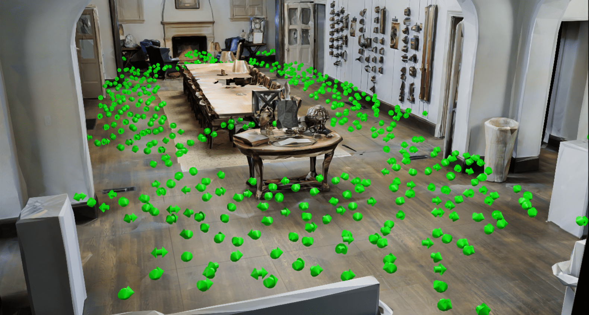
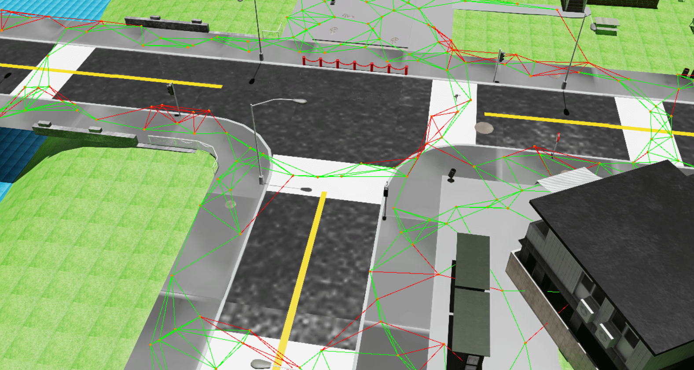
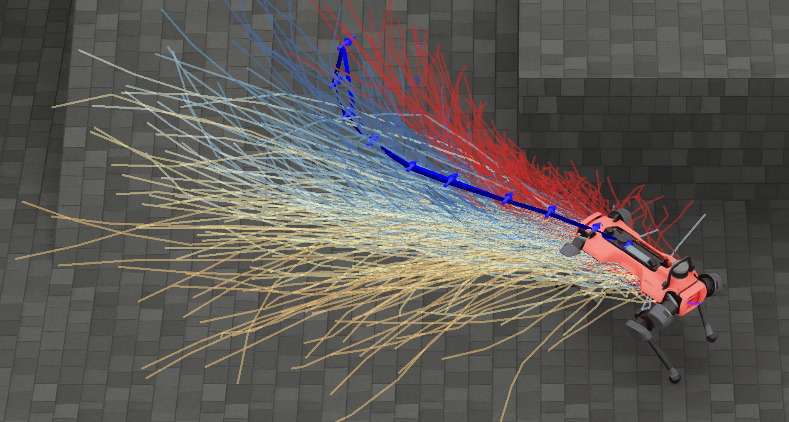
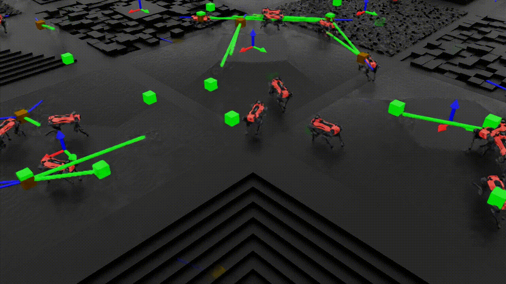
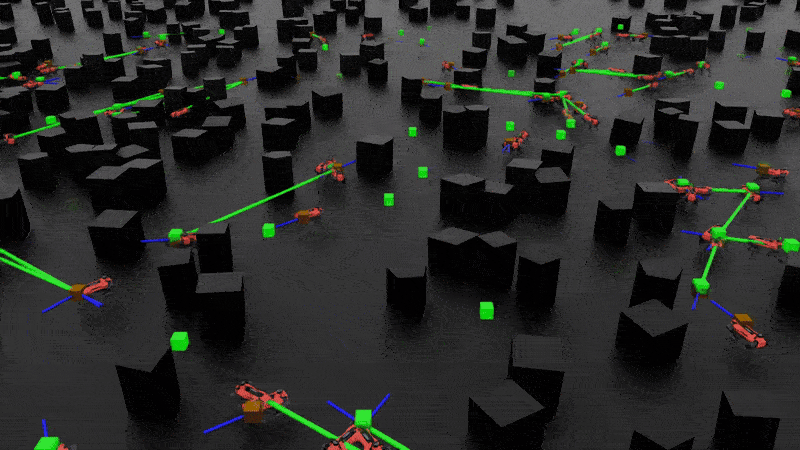
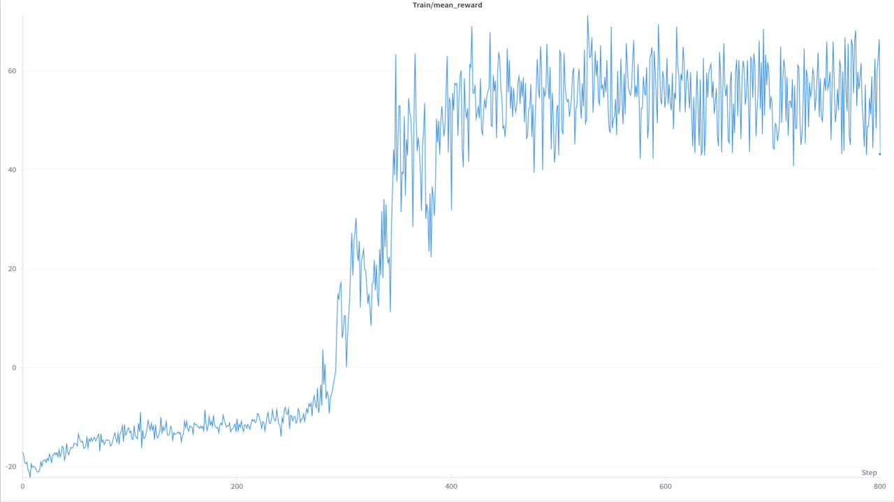

# Isaac Navigation Suite

[](https://docs.omniverse.nvidia.com/isaacsim/latest/overview.html)
[](https://isaac-sim.github.io/IsaacLab)
[](https://docs.python.org/3/whatsnew/3.10.html)
[](https://releases.ubuntu.com/24.04/)
[](https://pre-commit.com/)
[](https://opensource.org/license/apache-2-0)


<table style="border-collapse:collapse;border:none;width:100%;">
  <tr>
    <td style="text-align:center;border:none;">
      <strong>Data Generation</strong><br/>
      
    </td>
    <td style="text-align:center;border:none;">
      <strong>Traversability Analysis</strong><br/>
      
    </td>
    <td style="text-align:center;border:none;">
      <strong>Policy Learning</strong><br/>
      
    </td>
  </tr>
</table>


**Isaac Navigation Suite** is a framework for robotic navigation task. It is meant to unify navigation-relevant environments,
data-sampling approaches, typical RL terms and a benchmarking environment. Currently, the suite includes two extensions:

## Table of Contents
- [nav_suite Extension](#nav_suite-extension)
- [nav_tasks Extension](#nav_tasks-extension)
- [Installation](#installation)
- [Usage and Examples](#usage)
- [Citing](#citing)
- [License](#license)
- [Support](#support)


## `nav_suite` Extension

This extension lets you load realistic terrains complete with rich semantic annotations, run fast traversability analysis, and render large batches of multi-modal data. It exposes three core modules:

  - **Environment Importer** – load Matterport, Unreal/Carla, generated or USD terrains and expose all geometric / semantic domains&nbsp;→ [Details](exts/nav_suite/docs/README.md#environment-importer)
  - **Data Collectors** – sample trajectories, viewpoints and render multi-modal data from any imported world&nbsp;→ [Details](exts/nav_suite/docs/README.md#data-collectors)
  - **Terrain Analysis** – build traversability height-maps and graphs for path planning and curriculum tasks&nbsp;→ [Details](exts/nav_suite/docs/README.md#traversabilty-analysis)

## `nav_tasks` Extension

This extension provides a comprehensive library of reusable MDP terms—usable in reinforcement-learning pipelines and in unsupervised or supervised navigation objectives—and ships with an example PPO training setup.


### MDP Components

#### Goal Commands

- **GoalCommand:** Samples goal positions using terrain analysis, ensuring feasibility and diversity.
- **ConsecutiveGoalCommand:** Generates a sequence of terrain-aware goals, resampling as each is reached.
- **FixGoalCommand:** Provides fixed goal positions.

#### Reward Terms

- **near_goal_stability:** Rewards stability and low velocity near the goal.
- **near_goal_angle:** Rewards correct heading at the goal.
- **backwards_movement / lateral_movement:** Encourage or penalize specific movement directions.
- **SteppedProgressTerm:** Discrete reward for progress toward the goal.
- **AverageEpisodeVelocityTerm:** Rewards average velocity upon reaching the goal.

#### Terminations & Events

- **At Goal:** Ends episode when the agent reaches the goal.
- **Timeouts:** Proportional to goal distance.
- **StayedAtGoal:** Ensures the agent remains at the goal for a set time.
- **Reset Events:** Use terrain analysis to place the robot at feasible spawn points.

### Example RL Training

To start training a example navigation policy, use:

```bash
python -m isaaclab.train --task NavTasks-DepthImgNavigation-PPO-Anymal-D-TRAIN
```

**Demo Recording**

Visualizations of the trained policy in action with an example reward curve for the policy trained in rough terrain:

<div style="display: flex; justify-content: space-between;">
    
    
    
</div>


## Installation

1. Install IsaacLab following the [IsaacLab installation guide](https://isaac-sim.github.io/IsaacLab/main/source/setup/installation/index.html).
2. Clone this repo and install the extensions. Note that the nav_suite has been tested with ``IsaacLab v2.1.0``  (commit 91ad494). We try to be in sync with the latest IsaacLab version, but minor issues can occur. \
  NOTE: Please use an IsaacLab version where [PR77](https://github.com/leggedrobotics/IsaacLab-Internal/pull/77) have been merged, they contain changes necessary to run the scripts successfully.

```bash
git clone git@github.com:isaac-sim/IsaacLab.git
git clone git@github.com:leggedrobotics/isaac-nav-suite.git
cd <path-to-your-isaaclab-repo>
git checkout v2.1.0

./isaaclab.sh -p -m pip install -e <path-to-your-nav-suite-repo>/exts/nav_suite
./isaaclab.sh -p -m pip install -e <path-to-your-nav-suite-repo>/exts/nav_tasks
```

3. Some files of the ``nav_suite`` are located on git lfs (such as policies or terrains). Please install git lfs following the [Installation Guide](https://docs.github.com/en/repositories/working-with-files/managing-large-files/installing-git-large-file-storage) and then pull the files.

```bash
cd <path-to-your-nav-suite-repo>
git lfs pull
```


### Docker and Cluster Installation

1. Get the IsaacLab docker, following the description [Docker Guide](https://isaac-sim.github.io/IsaacLab/source/deployment/docker.html).
2. Add the nav-suite as a submodule to the IsaacLab repo.

  ```bash
  cd <path-to-your-isaaclab-repo>
  git submodule add git@github.com:leggedrobotics/isaac-nav-suite.git
  git submodule update --init --recursive
  ```

3. Create symlinks to the extensions. Make sure that these are relative in order to be included in the docker image.

  ```bash
  cd <path-to-your-isaaclab-repo>/source
  ln -s ../../isaac-nav-suite/exts/nav_suite .
  ln -s ../../isaac-nav-suite/exts/nav_tasks .
  ```

4. Bin the extension into your docker container to reflect changes inside the docker on your host. To do so add the
   following lines to the `docker/docker-compose.yaml` file:

    ```yaml
    - type: bind
      source: ../isaac-nav-suite
      target: ${DOCKER_ISAACLAB_PATH}/isaac-nav-suite
    ```

4. Rebuild your docker image to install the additional extensions and let the bind take effect.

  ```bash
  cd <path-to-your-isaaclab-repo>
  ./docker/container.py start
  ```

## Usage

### Download Example Environments

The suite comes with some example environments. Carla that can be downloaded using the following link [Carla (Unreal Engine)](https://drive.google.com/file/d/1vOf1Fp6CGtBdLWZ2Q3r0tkYQLQHM7Y0A/view?usp=sharing). To download Matterport datasets, please refer to the [Matterport3D](https://niessner.github.io/Matterport/) website.
The NVIDIA Warehouse environment is already included in the repo.

The downloaded environments should be extracted to
`<path-to-your-nav-suite-repo>/exts/nav_suite/data/[matterport, unreal/town01]`. The paths in the scripts are
already set to these directories.


### Workflow

Standalone scripts can be used to customize the functionalities and easily integrate different parts of the extensions for your own projects.
Here we provide a set of examples that demonstrate how to use the different parts:

- ``nav_suite``
  -  ``importer``
      - [Import a Matterport3D Environment](scripts/nav_suite/terrains/matterport_import.py)
      - [Import a Carla (Unreal Engine) Environment](scripts/nav_suite/terrains/carla_import.py)
      - [Import the Nvidia Warehouse Environment](scripts/nav_suite/terrains/warehouse_import.py)
  - ``collector``
      - [Sample Trajectories from Matterport](scripts/nav_suite/collector/matterport_trajectory_sampling.py)
      - [Sample Viewpoints and Render Images from Carla (Unreal Engine)](scripts/nav_suite/collector/carla_viewpoint_sampling.py)

## Citing

The current version was developed as part of the ViPlanner ([Paper](https://arxiv.org/abs/2310.00982) | [Code](https://github.com/leggedrobotics/viplanner)) and perceptive forward dynamcis model ([Paper](https://arxiv.org/abs/2504.19322) | [Webpage](https://leggedrobotics.github.io/fdm.github.io/)).

We are currently preparaing a workshop paper submission. Up to that point, if you use this code in a scientific
publication, please cite the following [paper](https://arxiv.org/abs/2310.00982) if you use the Matterport related implementations:
```
@article{roth2023viplanner,
  title     ={ViPlanner: Visual Semantic Imperative Learning for Local Navigation},
  author    ={Pascal Roth and Julian Nubert and Fan Yang and Mayank Mittal and Marco Hutter},
  journal   = {2024 IEEE International Conference on Robotics and Automation (ICRA)},
  year      = {2023},
  month     = {May},
}
```

or [paper](https://arxiv.org/abs/2504.19322) for the rest of the code:

```
@inproceedings{roth2025fdm,
  title={Learned Perceptive Forward Dynamics Model for Safe and Platform-aware Robotic Navigation},
  author={Roth, Pascal and Frey, Jonas and Cadena, Cesar and Hutter, Marco},
  booktitle={Robotics: Science and Systems (RSS 2025)},
  year={2025}
}
```

## License

The repository is released under [Apache 2.0](LICENSE). The license files of its dependencies and assets are present in the [`docs/licenses`](docs/licenses) directory.


## Support
This repository contains research code, except that it changes often, and any fitness for a particular purpose is disclaimed.

* Please use GitHub [Discussions](https://github.com/leggedrobotics/nav-suite/discussions) for discussing ideas, asking questions, and requests for new features.
* Github [Issues](https://github.com/leggedrobotics/nav-suite/issues) should only be used to track executable pieces of work with a definite scope and a clear deliverable. These can be fixing bugs, documentation issues, new features, or general updates.
