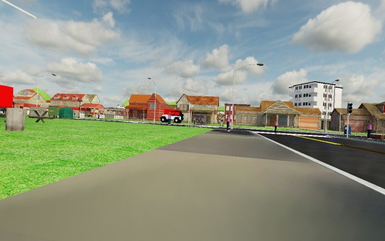
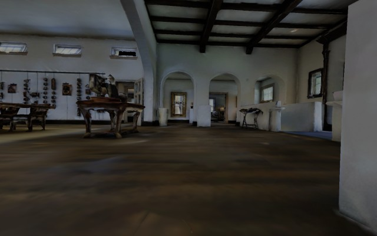
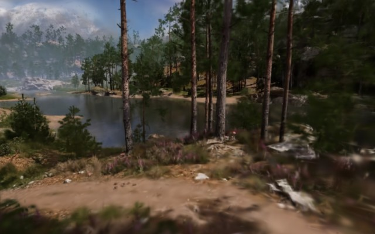
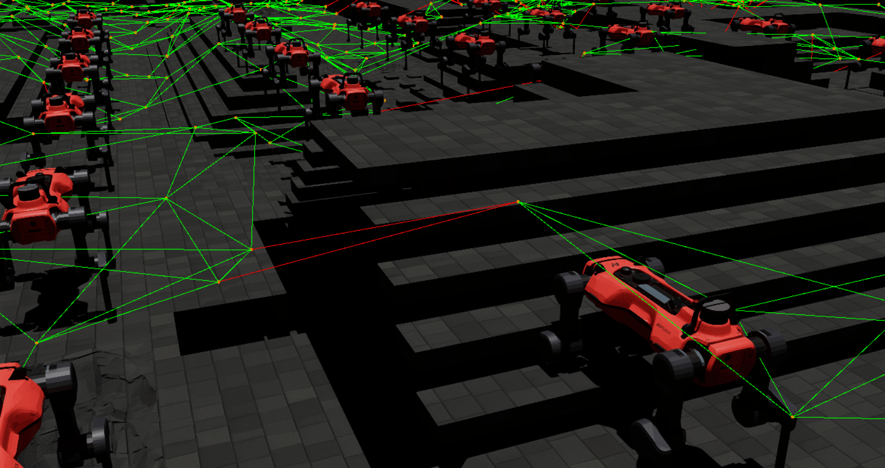
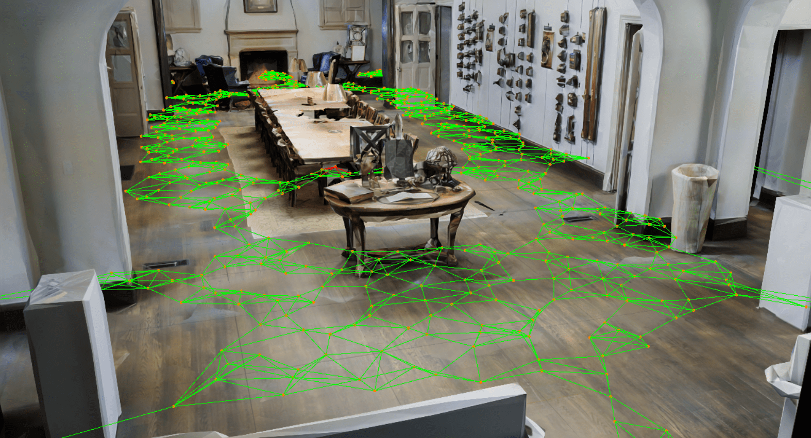
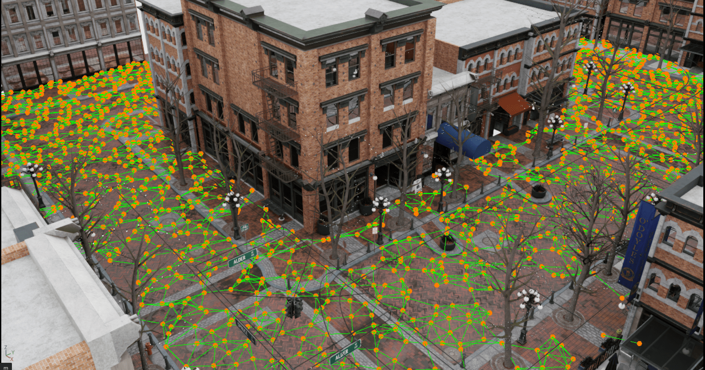

# Navigation Suite

## Environment Importer

<div style="display: flex; justify-content: space-between;">
    
    
    
</div>

<br/>

This extensions allows to import diverse environments into Isaac Sim and make their domains available for downstream tasks.

<details>
    <summary><strong>matterport</strong></summary>

When importing matterport meshes, you can either input the original ``.obj`` or an already converted ``.usd`` file. In addition, a ``.ply`` file can be defined which is necessary to access the semantic domain and allow for faster access to the geometric domain. In the case, the mesh should only be investigated, no definition is necessary. Following some mesh parameters can be defined which are relevant when employing a robot in the environment.

**Semantic Domain**: Regarding the semantic domain, Matterport3D comes with a set of very detailed set of classes. Per default, we use the reduced set of 40 classes with their colors defined [here](../data/matterport/mpcat40.tsv). The custom sensors access the information and make them available for further processing.


</details>

<details>
    <summary><strong>multi-mesh-usd</strong></summary>

For any ``.usd`` file that consist out of multiple meshes, use this type. First define the file location, then some mesh parameters can be defined which are relevant when employing a robot in the environment.

**Semantic Domain**: Most environments consist of multiple meshes. The extensions provides an easy name to class mapping tool, whereas all meshes that include defined string will be assigned a certain class. More precisely, for each environment a ``keyword_mapping.yml`` file has to be defined, [example](../data/unreal/town01/keyword_mapping.yml). This file is organized as follows:

```yaml
class_name_1:
  - regex_expression1
  - regex_expression2
class_name_2:
  - regex_expression3
  - regex_expression4
```

Then the ``class_name_1`` will be assigned to all meshes that include the ``regex_expression1`` or ``regex_expression2``. The same holds for ``class_name_2``. The semantic domain is then accessible via the USD camera sensor of isaaclab.


</details>

<details>
    <summary><strong>single-mesh-usd</strong></summary>

Single meshes allow for a speedup when accessing the different domains. Similar to the multi-mesh-usd setup, first, define the file location, then some mesh parameters which are relevant when employing a robot in the environment. Interesting meshes can be generated with a terrain-generator available under https://github.com:leggedrobotics/terrain-generator

**Semantic Domain** The semantic domain for such meshes is currently not supported.

</details>

<details>
    <summary><strong>generated</strong></summary>

The IsaacLab Framework allows to generate environments and randomize their parameters. Also these environments can be used. To do so, define the ``module`` (e.g. ``isaaclab.terrains.config.rough``) and the config ``class`` (e.g. ``ROUGH_TERRAINS_CFG``). In addition, some terrain parameters can be set for deploying a robot on the terrain.

**Semantic Domain** The semantic domain for such meshes is currently not supported.

</details>


### Standalone scripts

Standalone scripts are provided to demonstrate the loading of different environments:

- [Import a Matterport3D Environment](../../../scripts/nav_importer/matterport_import.py)
- [Import a Carla (Unreal Engine) Environment](../../../scripts/nav_importer/carla_import.py)
- [Import the Nvidia Warehouse Environment](../../../scripts/nav_importer/warehouse_import.py)

> [!NOTE] **Matterport Sensors**: \
> For ``matterport`` meshes, always use the custom sensors.
> Matterport meshes are loaded as many different meshes which is currentlt not supported in IsaacLab.
> Instead, the ``MatterportRaycaster`` and ``MatterportRayCasterCamera`` uses the ply mesh which is a single mesh that additionally includes the semantic domain.


## Data Collectors

This extensions allows to collect data from the previously loaded environments and all their domains.

- `Trajectory sampling`:

    For trajectory sampling the environment is first analysed and a graph is constructed in the traversable space. What is traversable can be defined in the corresponding [config file](../nav_suite/terrain_analysis/terrain_analysis_cfg.py).

    **Important** for the analysis also regarding the semantic domain, a semantic class to cost mapping has to be defined in the config. Per default, an example cost map for ``matterport`` environments is selected.

    Then trajectories (i.e. start-goal pairs and their length) are sampled from the graph. You can define the ``module`` and the ``class`` of the parameters config that is used for the sampling. An example is provided that is optimized for the legged robot ANYmal and a matterport environment.

    The trajectory sampling can be executed multiple times with different number of sampled trajectories as well as different minimum and maximum lengths.

- `Sensor data sampling and rendering`:

    For the sensor data sampling the same terrain analysis as for the trajectory sampling is executed. The graph and traversability parameters are defined in corresponding [config file](../nav_suite/terrain_analysis/terrain_analysis_cfg.py).

    **Important** for the analysis also regarding the semantic domain, a semantic class to cost mapping has to be defined in the config. Per default, an example cost map for ``matterport`` environments is selected.

    Each node of the graph is a possible data sampling point, with the orientation uniformly sampled between variable bounds. The exact parameters of the sampling can be defined [here](../nav_suite/collectors/sensor_data_sampling_cfg.py). How the individual sensor  data is treated is defined in individual sensor modules, i.e., [Camera](../nav_suite/collectors/sensors/camera_cfg.py), [RayCaster](../nav_suite/collectors/sensors/raycaster_cfg.py).
    An example is provided that is optimized for the legged robot ANYmal and a matterport environment. Please note that this configuration assumes that two cameras are added where the first one has access to semantic information and the second to geometric information.

### Standalone scripts

Standalone scripts are provided to demonstrate the loading of different environments:

  - [Sample Trajectories from Matterport](../../../scripts/nav_suite/collector/matterport_trajectory_sampling.py)
  - [Sample Camera Viewpoints and Render Images from Carla (Unreal Engine)](../../../scripts/nav_suite/collector/carla_sensor_data_sampling.py)


> [!NOTE] **Matterport Sensors**: \
> For `matterport` meshes, always use the custom sensors.
> Matterport meshes are loaded as many different meshes which is currently not supported in IsaacLab.
> Instead, the `MatterportRaycaster` and `MatterportRayCasterCamera` uses the ply mesh which is a single mesh that additionally includes the semantic domain.


## Traversabilty Analysis

<div style="display: flex; justify-content: space-between;">
    
    
    
</div>

This module analyses loaded environments to build a traversability map and navigation graph that downstream tasks can query (such as the data collection tools or MDP terms of the `nav_tasks` extension).

The `terrain_analysis` workflow builds a dense, door-aware height-map via ray-casting, samples feasible surface nodes, links them into a traversability graph while pruning edges that violate geometric, height or semantic constraints, and exposes shortest-path queries for start–goal generation. All thresholds, connection counts, semantic cost maps, bounding boxes and visualisation options are configurable through `TerrainAnalysisCfg` / `TerrainAnalysisSingletonCfg`, with optional live rendering of the height-map, sampled points and accepted/rejected edges for quick inspection.
